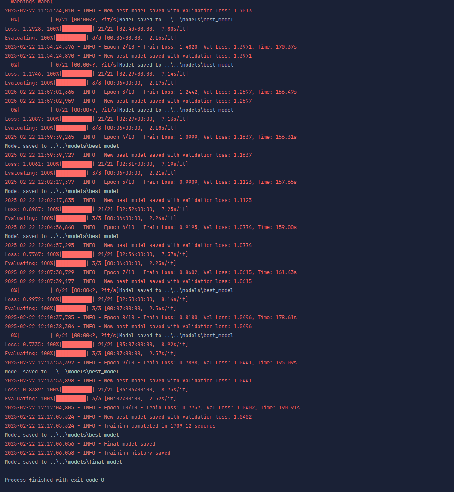

# Taura - Kikuyu-English Translation Project

The name "taura" is derived from the Kikuyu word 'Taũra', which means 'Translate', which is exactly what this project aims to do.

## Project Overview

Taura is a machine translation model for translating text between Kikuyu and English languages. Kikuyu is a Bantu language spoken by the Kikuyu people of Kenya. It's the most widely spoken language in Kenya, after English and Swahili.

## Project Structure

```
taura/
├── data/                     # Data directory
│   ├── raw/                  # Raw collected data
│   ├── processed/            # Processed and tokenized data
│   ├── English20Kikuyu20Pairs2029.xlsx  # Sample dataset
│   └── external/             # External datasets
├── models/                   # Model checkpoints and configurations
├── notebooks/                # Jupyter notebooks for experimentation
├── src/
│   ├── data/                 # Scripts for data collection, preparation
│   │   ├── explore_data.py   # Script to explore the dataset
│   │   ├── preprocess.py     # Data preprocessing script
│   │   └── tokenize.py       # Tokenization script
│   ├── features/             # Feature engineering
│   ├── models/               # Model definition and training scripts
│   │   ├── translation_model.py  # Model architecture definition
│   │   ├── train.py          # Training script
│   │   ├── evaluate.py       # Evaluation script
│   │   └── translate.py      # Inference script for translation
│   └── visualization/        # Scripts for visualizing results
├── results/                  # Evaluation results and outputs
├── tests/                    # Unit tests
├── .gitignore                # Git ignore file
├── LICENSE                   # License file
├── README.md                 # Project documentation (this file)
└── requirements.txt          # Project dependencies
```

## Getting Started

### Prerequisites

- Python 3.12+
- PyTorch 1.9+
- Transformers 4.20+

### Installation

1. Clone the repository:
   ```
   git clone <repository-url>
   cd taura
   ```

2. Create and activate a virtual environment:
   ```
   python -m venv .venv
   source .venv/bin/activate  # On Windows: .venv\Scripts\activate
   ```

3. Install dependencies:
   ```
   pip install -r requirements.txt
   ```

## Data Processing

1. Explore the dataset:
   ```
   cd src/data
   python explore_data.py
   ```

2. Preprocess the data:
   ```
   python preprocess.py
   ```

3. Tokenize the preprocessed data:
   ```
   python tokenize.py
   ```
# Training Process

The model is trained using a sequence-to-sequence transformer architecture. The training process involves:

1. Loading and preprocessing Kikuyu-English parallel data
2. Tokenizing the data using a pretrained tokenizer
3. Fine-tuning a pre-trained model on the Kikuyu-English dataset
4. Regularly evaluating on a validation set to prevent overfitting



The graph above shows the training and validation loss over 10 epochs.

## Model Training

Train the translation model:
```
cd src/models
python train.py --model "Helsinki-NLP/opus-mt-en-mul" --batch-size 16 --epochs 10
```

Options:
- `--model`: Pretrained model to fine-tune (default: "Helsinki-NLP/opus-mt-en-mul")
- `--batch-size`: Batch size for training (default: 16)
- `--epochs`: Number of training epochs (default: 10)
- `--lr`: Learning rate (default: 5e-5)
- `--warmup`: Number of warmup steps (default: 0)
- `--from-scratch`: Train from scratch instead of fine-tuning
- `--device`: Device to use (cuda/cpu)

## Model Evaluation

Evaluate the trained model:
```
python evaluate.py --model "../../models/best_model"
```

Options:
- `--model`: Path to the saved model (default: best_model)
- `--tokenizer`: Tokenizer to use (default: "Helsinki-NLP/opus-mt-en-mul")
- `--batch-size`: Batch size for evaluation (default: 16)
- `--test-set`: Name of the test set to use (default: "test")
- `--device`: Device to use (cuda/cpu)

## Translation

Use the trained model for translation:
```
python translate.py --text "Hello, how are you?"
```

Options:
- `--text`: Text to translate
- `--input-file`: Input file containing text to translate (one per line)
- `--output-file`: Output file for translated text (default: "translations.txt")
- `--model`: Path to the saved model
- `--tokenizer`: Tokenizer to use
- `--max-length`: Maximum sequence length (default: 128)
- `--direction`: Translation direction ('en-to-kik' or 'kik-to-en', default: 'en-to-kik')

You can also use the translation script in interactive mode by running it without the `--text` or `--input-file` arguments.

## Model Architecture

The project uses transformer-based neural machine translation models. The default approach is to fine-tune pretrained models like the Helsinki-NLP/opus-mt-en-mul model which is part of the OPUS-MT family, a collection of open translation models.

For Kikuyu-English translation, we adapt these models by:
1. Fine-tuning on our Kikuyu-English parallel data
2. Adapting the tokenizer for Kikuyu language specifics
3. Optimizing for limited data scenarios (low-resource language translation)

## Data Collection Strategies

The initial dataset contains pairs from the Excel file, but to expand the training data, consider:

1. Web scraping from bilingual websites, particularly:
   - Government websites with English and Kikuyu content
   - News sites that offer content in both languages
   - Religious texts (like the Bible) available in both languages

2. Collaboration with:
   - The Masakhane community (focused on NLP for African languages)
   - Local universities in Kenya
   - Native Kikuyu speakers for validation and additional translations

3. Data augmentation techniques:
   - Back-translation
   - Paraphrasing
   - Contextual data augmentation

## Acknowledgments

- The project was inspired by the [Masakhane initiative](https://www.masakhane.io/), which aims to strengthen and spur NLP research in African languages.
- Thanks to DigiGreen for providing the initial Kikuyu-English dataset on Hugging Face.
- The BibleTTS project for their work on African language speech datasets, which informed our approach to language processing.
- The Helsinki-NLP team for their multilingual translation models, which serve as the foundation for our fine-tuning approach.

## Contributing

Contributions are welcome! Please feel free to submit a Pull Request.

## License

This project is licensed under the MIT License - see the LICENSE file for details.

## Future Work

- Implement bidirectional translation (Kikuyu-to-English)
- Expand the dataset with more domain-specific content
- Explore low-resource techniques like transfer learning and data augmentation
- Integrate with speech recognition and synthesis for a complete translation pipeline
- Create a web interface for easy access to the translation system
